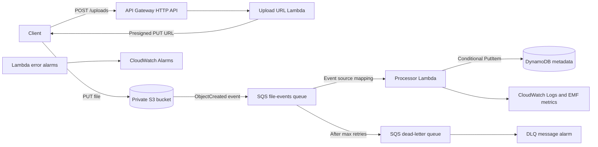

# AWS Event-Driven Processing Platform

A production-style, serverless file-ingestion platform built with AWS, Python,
and Terraform. Clients request a short-lived upload URL, upload directly to a
private S3 bucket, and let an asynchronous SQS/Lambda pipeline validate and
store file metadata in DynamoDB.

The project focuses on cloud architecture, distributed-system failure modes,
least-privilege security, observability, repeatable infrastructure, and CI.
No AWS resources are deployed automatically by CI.

## Architecture



### AWS services

| Service | Responsibility |
| --- | --- |
| API Gateway | Exposes the `POST /uploads` HTTP endpoint with IAM auth by default |
| Lambda | Validates upload requests and asynchronously processes file events |
| S3 | Stores encrypted, versioned uploads with all public access blocked |
| SQS | Buffers file events and isolates ingestion from processing capacity |
| SQS DLQ | Retains repeatedly failing messages for investigation and replay |
| DynamoDB | Stores one metadata item per immutable `file_id` |
| CloudWatch | Retains structured logs, EMF metrics, and operational alarms |
| IAM | Grants separate, least-privilege permissions to each Lambda |

## Event flow

1. An authenticated client sends a file name and content type to
   `POST /uploads`.
2. The upload Lambda accepts `.csv`, `.json`, and `.txt` files, creates a UUID,
   and returns a presigned S3 PUT URL valid for a configurable short period.
3. The client uploads directly to `uploads/<file_id>/<file_name>` in S3. The
   application never proxies file bytes through Lambda.
4. S3 publishes an `ObjectCreated` notification to the encrypted SQS queue.
5. The processor Lambda consumes the message, validates the event, extracts
   metadata, and conditionally writes the item to DynamoDB.
6. CloudWatch receives JSON application logs and Embedded Metric Format (EMF)
   metrics for generated URLs, processed files, duplicates, and errors.

Stored metadata includes `file_id`, `file_name`, `bucket`, `object_key`, `size`,
`status`, `uploaded_at`, and `processed_at`.

## Why SQS and a DLQ?

Calling the processor synchronously from the upload request would couple API
latency and availability to downstream capacity. SQS absorbs traffic bursts,
provides durable at-least-once delivery, applies backpressure, and lets Lambda
scale independently. Failed messages are retried without making clients upload
again. After the configured receive count, the DLQ isolates poison messages so
operators can inspect and replay them without blocking healthy work.

At-least-once delivery means duplicates are expected. The worker uses a
DynamoDB conditional expression (`attribute_not_exists(file_id)`) as an atomic
idempotency guard. A duplicate is logged and acknowledged rather than retried.
For mixed SQS batches, partial batch responses retry only failed messages.

## Reliability and observability

- SQS visibility timeout is required to be at least six times the Lambda
  timeout, following AWS guidance for Lambda event source mappings.
- Messages move to the DLQ after five failed receives by default and remain
  there for 14 days.
- The processor caps event-source concurrency and returns per-message failures.
- DynamoDB point-in-time recovery and server-side encryption are enabled.
- Lambda log groups have configurable retention instead of indefinite storage.
- Logs include `request_id`, `file_id`, `event_type`, `status`, and `error`.
- CloudWatch alarms cover both Lambda functions and visible DLQ messages.
- Optional SNS topic ARNs can be supplied as alarm actions.

## Security decisions

- S3 Block Public Access, bucket-owner-enforced ownership, AES-256 encryption,
  and versioning are enabled.
- The API uses `AWS_IAM` authorization by default and has route throttling.
- Presigned URLs are short lived and bind the file key and content type.
- File names, extensions, MIME types, body shape, and body size are validated.
- Upload and processor Lambdas use separate IAM roles scoped to exact resource
  ARNs and necessary actions.
- S3 may send only from the provisioned bucket and AWS account to the queue.
- There are no credentials or application secrets in source code or Terraform.
- Terraform state, plans, local variables, `.env` files, venvs, and archives are
  excluded from Git.

## Repository structure

```text
aws-event-driven-processing-platform/
├── .github/workflows/ci.yml
├── lambdas/
│   ├── processor/
│   │   ├── handler.py
│   │   └── requirements.txt
│   └── upload_url/
│       ├── handler.py
│       └── requirements.txt
├── terraform/
│   ├── main.tf
│   ├── outputs.tf
│   ├── providers.tf
│   ├── terraform.tfvars.example
│   └── variables.tf
├── tests/
│   ├── conftest.py
│   ├── test_processor.py
│   └── test_upload_url.py
├── .gitignore
├── README.md
└── requirements-dev.txt
```

## Local setup and testing

Python 3.12 or newer is recommended. Tests mock AWS boundaries and do not need
AWS credentials or create cloud resources.

```bash
python3 -m venv .venv
source .venv/bin/activate
python -m pip install --requirement requirements-dev.txt
python -m pytest -v --cov=lambdas --cov-report=term-missing
```

## Terraform checks

Install Terraform 1.6 or newer, then run:

```bash
terraform -chdir=terraform fmt -check -recursive
terraform -chdir=terraform init -backend=false
terraform -chdir=terraform validate
```

`terraform validate` does not deploy infrastructure. Provider downloads require
network access, but AWS credentials are not required for formatting or static
validation.

## Deployment

Deployment is intentionally manual. Configure an AWS CLI profile or workload
identity with permission to create the documented resources. Never place access
keys in this repository.

```bash
cp terraform/terraform.tfvars.example terraform/terraform.tfvars
terraform -chdir=terraform init
terraform -chdir=terraform plan -out=tfplan
terraform -chdir=terraform apply tfplan
terraform -chdir=terraform output
```

For shared environments, configure an encrypted remote backend with state
locking before `terraform init`. Review the plan, resource names, IAM policies,
alarm destinations, and estimated AWS costs before applying.

With the default `AWS_IAM` route authorization, invoke the API using a SigV4
capable client. The response supplies the URL and required content type for a
direct HTTP PUT to S3. Set `api_authorization_type = "NONE"` only for an
explicitly public demonstration and compensate with appropriate abuse controls.

To remove a non-production environment, empty any retained bucket objects as
appropriate and run `terraform -chdir=terraform destroy`. Destruction is never
performed by CI.

## CI/CD

GitHub Actions runs two independent jobs on pushes to `main` and pull requests:

- Python 3.12 installs pinned development dependencies and runs pytest with
  coverage.
- Terraform 1.9.8 checks formatting, initializes providers without a backend,
  and validates the configuration.

The workflow requests only read access to repository contents. It contains no
AWS credentials and has no `terraform plan`, `apply`, or `destroy` step.
